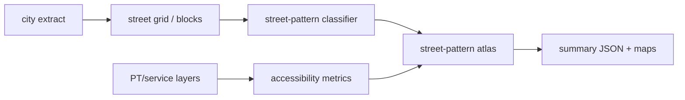
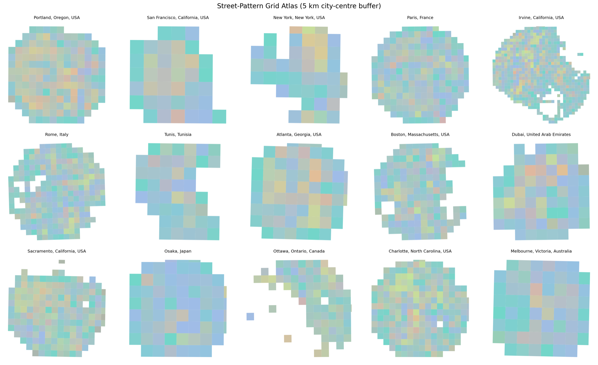

# segregation-by-design-experiments

Street-pattern, transit, and service-accessibility experiments for testing how morphology relates to reachable services and generated routes.

## System Map



## Main Result



## Run

Entrypoint: `run_street_pattern_city.py`

Human:

```bash
python run_street_pattern_city.py --place "Portland, Oregon, USA" --buffer-m 5000 --grid-step 500 --device cpu --output outputs/portland_summary.json
```

Agent: inspect the summary JSON and rendered atlas PNG before claiming pattern/accessibility results.

## Publication

No standalone publication tracked; thesis integration is in the parent repo.

## Next Steps / Heuristics

Heuristic: keep mechanism experiments separate from the production pipeline. Morphology context is useful only when coverage and class balance are visible.
